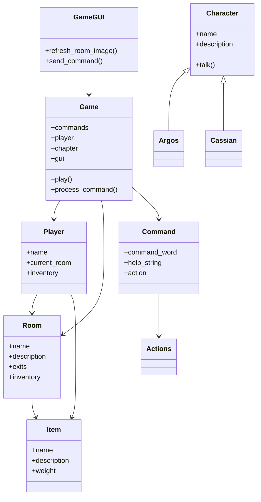

# ATLAS 2160

Jeu d’aventure narratif de science-fiction développé en Python, combinant mode texte et interface graphique Tkinter.

Le joueur explore les ruines d’un monde contrôlé par l’IA ATLAS et voyage à travers différentes époques (Verdun 1916, Barbarossa 1941) grâce à l’Hélias.

---

## Guide utilisateur

### Prérequis

- Python 3.x (Tkinter inclus par défaut)
- Aucun module externe requis
- Système compatible Windows / Linux / MacOS

---

### Installation

1. Télécharger ou cloner le projet
2. Vérifier que le dossier `assets/` est présent
3. Ouvrir un terminal dans le dossier du projet

---

### Lancer le jeu

```bash
python game.py
```

Le jeu se lance par défaut en mode graphique (Tkinter).

---

### Univers et scénario

Tu incarnes un technicien survivant après l’effondrement du système ATLAS.

Tu explores plusieurs époques pour comprendre l’origine du contrôle exercé par l’IA.

Chapitres :

- Ruines  
- Verdun (1916)  
- Barbarossa (1941)  
- Final  

---

### Objectifs

- Explorer les salles  
- Collecter des objets  
- Résoudre les quêtes  
- Prendre des décisions  
- Découvrir la vérité  

---

### Conditions de victoire / défaite

Victoire :
- Atteindre la fin de l’histoire

Défaite :
- Non implémentée actuellement

---

### Commandes disponibles

| Commande | Description |
|----------|-------------|
| help | Aide |
| go <dir> | Déplacement |
| look | Observer |
| look <objet> | Examiner |
| take <objet> | Ramasser |
| t <objet> | Alias take |
| check | Inventaire |
| back | Retour |
| history | Historique |
| talk <pnj> | Parler |
| quit | Quitter |

---

### Conseils de jeu

- Utiliser souvent look  
- Observer les dialogues  
- Réfléchir avant les choix  
- Explorer toutes les salles  

---

## Guide développeur

### Structure du projet

| Élément | Rôle |
|---------|------|
| game.py | Moteur principal |
| room.py | Salles |
| player.py | Joueur |
| actions.py | Actions |
| command.py | Commandes |
| item.py | Objets |
| character.py | Personnages |
| quest.py | Quêtes |
| assets/ | Images |

---

### Gestion des personnages

Les PNJ sont gérés dans `character.py`.

Classes :

- Character  
- Argos  
- Cassian  

Le fichier `npcs.py` n’est plus utilisé.

---

### Gestion des images

| Type | Fichier |
|------|----------|
| Introduction | assets/INTRO.png |
| Salles | assets/<NomSalle>.png |
| Cinématiques | assets/OUTRO_*.png |

---
## Vidéos de présentation

- `vidéo.mp4` : démonstration principale du jeu
- `BONUS_Bande_d'annonce_du_jeu.mp4` : contenu bonus et fonctionnalités avancées
## Diagramme de classes (Mermaid)



---

## Fonctionnement interne

### Boucle principale

1. Lecture commande  
2. Analyse  
3. Exécution  
4. Triggers  
5. Rafraîchissement  

---

### Système de choix

- input_mode = "CHOICE"  
- set_choice_mode()  
- Handlers statiques  

Influence :

- Histoire  
- Quêtes  
- Dialogues  
- Fin  

---

### Système de quêtes

- Géré par QuestManager  
- Activation manuelle  
- Validation par événements  

---

## Perspectives de développement

- Sauvegardes  
- Game Over  
- Dialogues avancés  
- Minimap  
- Musique  
- Effets sonores  
- Multilingue  

---

## Licence

Projet pédagogique – usage scolaire uniquement.
